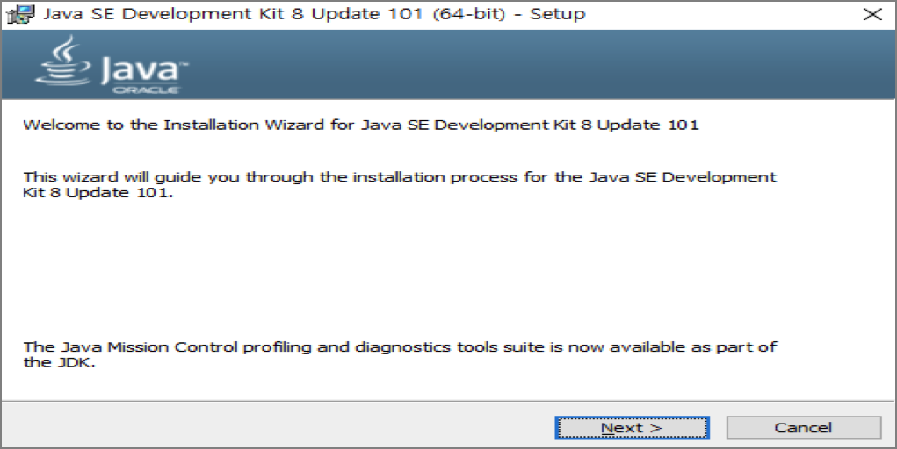
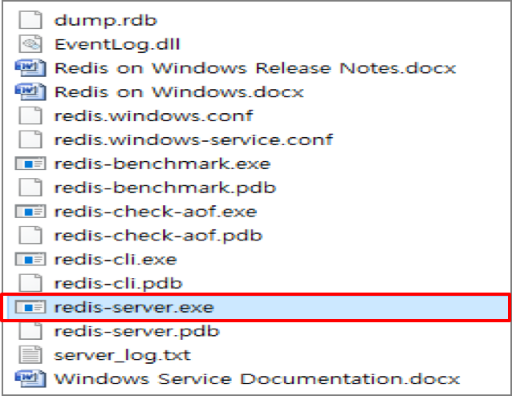

     
# 
Things Framework
### 
Developers’ Guide
     

### 
2017.03
 
### 
Hatio Lab. 기술 연구소1

            
### 1 개발환경 구성
#### 1.1	Server
기본 개발 환경

|  구분    |     항목 |   권장버전  |
| :--------: | :--------:| :------: |
| 기본환경   |   Java Development Kit |  1.8  |
|   |   Servlet  |  3.0 이상  |
|   |   Spring Tool Suite   |  3.8.3  |
|  Database     |   PostgreSQL    |  3.0 이상  |
|  WAS          |   Tomcat   |  8.0.30 이상 |
|  Cache Server |   Redis   |  3.0 이상  |

##### 1.1.1	Install Java

Oracle Homepage에서 JDK 8를 Download 받는다.

https://java.com/ko/download/

파일을 실행하여 설치를 실행한다.


환경 변수 등록을 위해, '제어판-시스템-고급시스템-고급-환경변수'를 실행한다.

시스템 변수에 '새로 만들기'를 클릭하여 시스템 변수를 등록한다.

Path 변수에 아래와 같이 설정을 추가한다.


명령 프롬프트를 실행하여, JDK가 정상적으로 설치되었는지 확인한다.

##### 1.1.2	Install PostgresSQL

http://www.enterprisedb.com/products-services-training/pgdownload#windows접속 후, 자신의 OS환경에 맞는 파일을 다운로드 한다.


postgres를 설치하면 서버와 함께 관리자 클라이언트(PgAmin)가 설치될 것이다. 여기서는 pgAdmin을 이용하여 관리하는 내용을 설명한다.
프로그램 설치 후 'pgAdmin'을 실행하여 Database를 생성한다.

##### 1.1.3	Install Redis

https://github.com/MSOpenTech/redis/releases접속 후, 설치파일 다운로드를 실행한다

설치 파일을 실행하여 설치를 진행한다.

설치가 완료되었다면 'redis-server.exe' 파일을 실행하여, Redis Server를 실행한다.
(Console 창이 잠시 표시되었다가 사라 짐.)

Redis Client를 실행하여, Redis가 정상적으로 수행중인지 확인한다.
( 'ping' 입력 시 'PONG'으로 Return )



##### 1.1.4	Install Spring STS

https://spring.io/tools/sts/all접속 후, 자신의 OS환경에 맞는 3.8.3버전을 다운로드 한다.


압축을 해제한 후, STS.exe 파일을 실행하여 프로그램을 실행한다.

###### Buildship Gradle Plugin 설치
STS를 열고 Help - Eclipse Marketplace 실행한다.

검색 필드에 "Buildship"를 검색하여 Buildship Gradle을 설치한다.

##### 1.1.5 프로젝트 셋업

Eclipse 실행 후, Git연동을 위해 Git Perspective를 추가한다.

소스코드를 내려받기위해, Clone Repository를 생성한다.

( X-MES : https://github.com/hatiolab/xmes-master.git)

( X-MES : https://github.com/hatiolab/elidom.git )


Package Explorer에서 import>Gradle>Existing Gradle project을 선택하여 Next한다.
